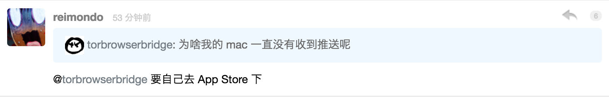

# v2ex-reply

> A chrome plugin for v2ex.com

Show replys for better browsing.

### Screenshot

### Usage

* Clone the repo with `git clone https://github.com/cyyyu/v2ex-reply.git`
* Run `npm i & npm dist`
* Manually load it into chrome.([a helpful blog here](https://www.cnet.com/how-to/how-to-install-chrome-extensions-manually/))
